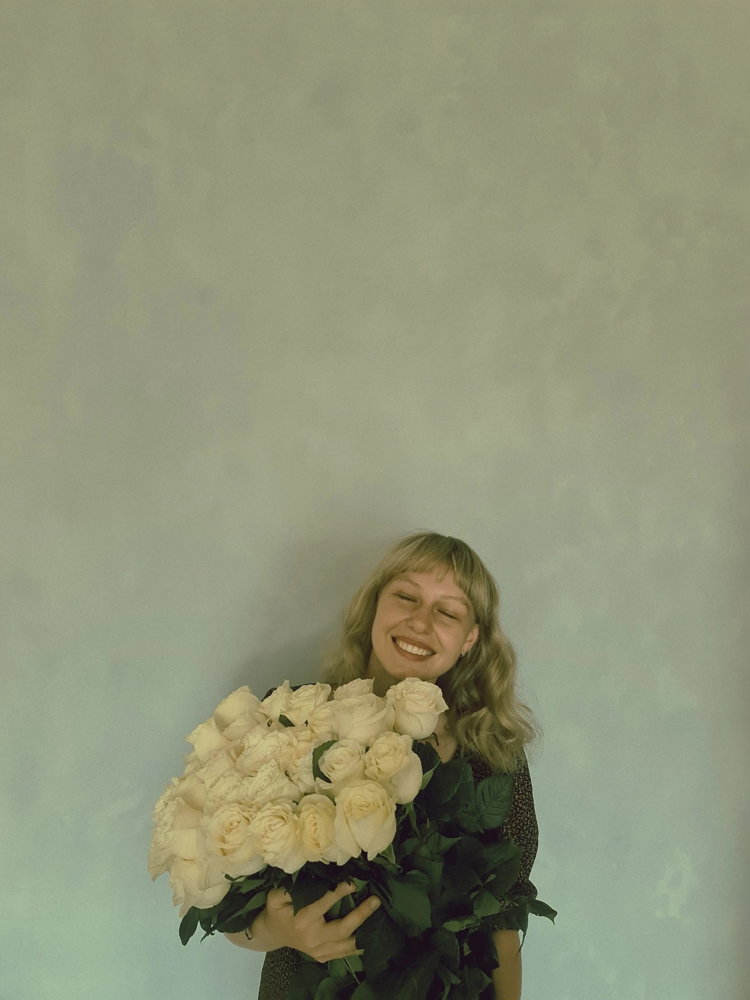

# Привет, меня зовут София!  

### 👩‍🏫 Профессиональная деятельность:  
- **Учитель математики** в школе.  
- **Тренер по скалолазанию** (работаю с детьми и взрослыми, помогаю развивать силу, выносливость и уверенность в себе).  

### 🎓 Образование:  
- **Окончила КГУ** с красным дипломом по специальности "Педагогическое образование, направленность математика, физика".  
- **Поступила в магистратуру** по направлению Обучение математике в профильных классах, чтобы углубить знания в предмете.  

### � Интересы и увлечения:  
- **Математика** — моя главная страсть! Люблю решать нестандартные задачи и делиться знаниями с учениками.  
- **Скалолазание** — совмещаю спорт и преподавание, тренирую других и сама постоянно развиваюсь.  
- **Туризм и альпинизм** — регулярно хожу в походы, покорила **Эльбрус** (высшая точка России — 5642 м).  
  
  